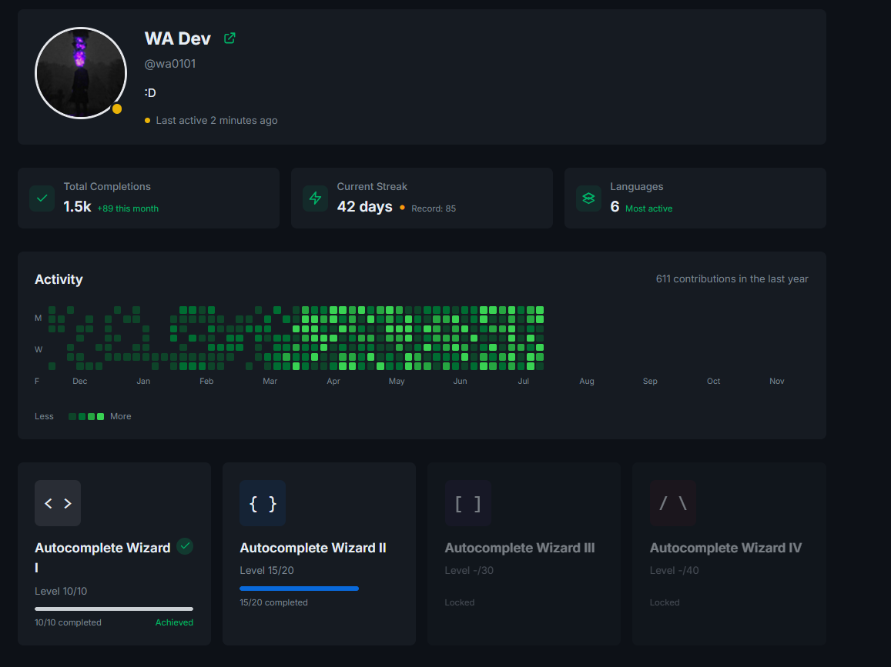

# Dev Profile Template

Hey! 👋 This is a template for building dev profile pages. Got inspired by Codeium and GitHub's profile pages - they look really clean so I thought it'd be cool to make a simple version that anyone can use as a starting point for their projects.

## What's in it?

- Dark theme
- Status indicator to show if someone's online
- Achievement cards (super basic rn but works)
- Activity graph (like GitHub's but simpler)
- Some stats to show off

## Screenshots

Here's how it looks:



## Todo List

Still needs work on:
- Activity graph data (pretty random rn)
- Achievement system (needs more stuff)
- Mobile view
- Probably more things

## Tech Used

- Astro (it's really nice for static sites)
- TypeScript (because any: never)
- Tailwind (makes CSS bearable)
- React (for the interactive bits)

## Want to use it?

1. Clone it:
```bash
git clone https://github.com/wa0101/Astro-Dev-Profile-Template
cd Astro-Dev-Profile-Template
```

2. Install dependencies:
```bash
npm install
```

3. Run it:
```bash
npm run dev
```

4. Check it out at [http://localhost:3000](http://localhost:3000)

## Make it yours

Just edit `src/config/profile.ts`:

```typescript
export const profileConfig = {
  user: {
    name: 'Your Name',
    bio: 'Whatever you want',
    // there's more stuff here
  }
}
```

## Files and Stuff

```
/
├── src/
│   ├── components/    # all the UI components
│   ├── config/       # profile settings
│   ├── layouts/      # page layouts
│   └── pages/        # routes
├── public/           # static files
└── Screenshots/      # screenshots
```

## Thanks

Shoutout to Codeium and GitHub - their profile UIs were the main inspiration. This is just a basic template you can build on top of for your own projects.

## Want to help?

Feel free to fix bugs or add cool stuff! Just remember this is a template, so keep it simple and easy to customize.
